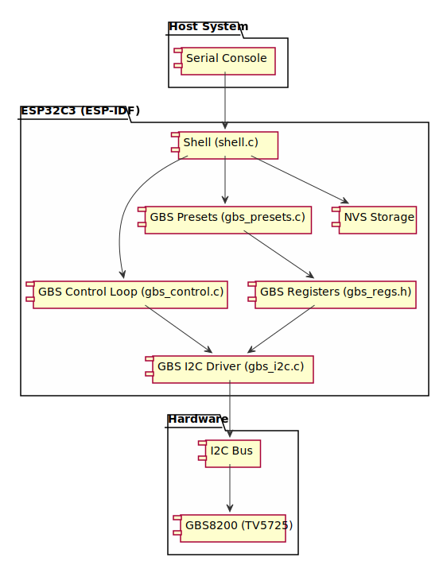

# GBS8200 Control – ESP-IDF Edition

[gbs-control](https://github.com/ramapcsx2/gbs-control) のコア機能をESP-IDFに移植したものです。
WiFi/WebUI/OLED/OSD/外部クロックを除去し、シリアルシェルによる操作を追加しています。

## アーキテクチャ



### データフロー

- **シリアルコンソール** → **Shell** レイヤーで入力をパース
- **Shell** → **GBS Presets** でプリセット選択・適用
- **GBS Presets** → **GBS Registers** で生レジスタ定義を参照
- **GBS Registers** → **GBS I2C Driver** で I2C 通信
- **I2C Bus** → **GBS8200** (TV5725 チップ)

## コンポーネント

| コンポーネント | 説明 |
|---------------|------|
| `gbs_i2c` | I2Cマスタードライバ (セグメントキャッシュ付き) |
| `gbs_regs` | レジスタ定義 + ビットフィールド読み書き |
| `gbs_presets` | プリセットデータ + 制御ロジック (初期化, プリセット適用, 同期検出) |
| `main/shell.c` | インタラクティブシリアルシェル |
| `main/gbs_control.c` | バックグラウンド制御タスク (同期監視, 自動ゲイン) |

## ハードウェア接続

| XIAO ESP32C3 | GBS8200 | 信号 |
|-------|---------|------|
| D4 (GPIO6) | SDA | I2C Data |
| D5 (GPIO7) | SCL | I2C Clock |
| GND | GND | グラウンド |

※ ピン番号は `gbs_i2c.h` で変更可能。

## ビルド & フラッシュ

```bash
# ESP-IDF環境をセットアップ済みであること
idf.py set-target esp32c3
idf.py build
idf.py flash monitor
```

**コンソール接続:**
- XIAO ESP32C3 の USB ポート（USB-Serial/JTAG）を使用
- 115200 bps での接続自動検出
- または手動設定: `screen /dev/ttyACM0 115200`

## シリアルコマンド

115200bps でシリアルコンソールに接続後:

```
gbs> help               # コマンド一覧
gbs> probe              # GBS8200 チップ検査 + Chip ID 読み出し
gbs> reso 1080p         # 出力解像度を1920x1080に設定
gbs> detect             # 入力信号を検出
gbs> apply              # 現在の設定でプリセット適用
gbs> status             # チップ状態表示
gbs> config             # 現在の設定一覧
gbs> output component   # コンポーネント出力に切替
gbs> set peaking 1      # シャープネス有効
gbs> log start          # リアルタイム同期ログ開始 (周期/パルス/FPS 表示)
gbs> log stop           # ログ停止
gbs> nvs                # NVS に保存済みの設定表示
gbs> save               # 現在の設定を NVS に保存
gbs> load               # NVS から設定復元
gbs> reg read 0 0x0B    # レジスタ読み出し (Chip ID)
gbs> dump 0             # セグメント0の全レジスタダンプ
gbs> exit               # ログ実行中の停止コマンド
```

### 主要コマンド

| カテゴリ | コマンド | 説明 |
|---------|---------|------|
| 検査 | `probe` | GBS8200 I2C 検査 |
| 解像度 | `reso 960p/480p/720p/1024p/1080p/downscale` | 出力解像度設定 |
| 出力 | `output vga/component` | VGA (RGB) / コンポーネント出力切替 |
| 検出 | `detect` | 入力信号自動検出 |
| 適用 | `apply` | プリセット再適用 |
| 位置 | `hpos +/-`, `vpos +/-` | 水平/垂直位置調整 |
| スケール | `hscale +/-`, `vscale +/-` | 水平/垂直スケール調整 |
| 設定 | `set <key> <value>` | 各種設定変更 (autogain, scanlines, deint, ftl など) |
| ログ | `log [start\|stop]` | リアルタイム同期ログ |
| ストレージ | `save` / `load` / `nvs` | NVS セッティング |
| レジスタ | `reg read/write <seg> <addr> [val]` | 生レジスタアクセス |
| ダンプ | `dump <0-5\|all>` | レジスタダンプ |
| 状態 | `status` / `config` | チップ状態 / 設定表示 |
| リセット | `reset` / `init` | リセット / 完全初期化 |

## 対応出力解像度

| 設定値 | 解像度 |
|--------|--------|
| 960p | 1280x960 |
| 480p | 720x480 (NTSC) / 768x576 (PAL) |
| 720p | 1280x720 |
| 1024p | 1280x1024 |
| 1080p | 1920x1080 |
| downscale | ダウンスケール |

## ライセンス

このプロジェクトは、[gbs-control](https://github.com/ramapcsx2/gbs-control) プロジェクトのコードをベースにしています。
元のプロジェクトのライセンス (GPL 3.0) に従い、このプロジェクトも **GNU General Public License v3.0** の下でライセンスされます。

詳細は、リポジトリに含まれる `LICENSE` ファイルを参照してください。
