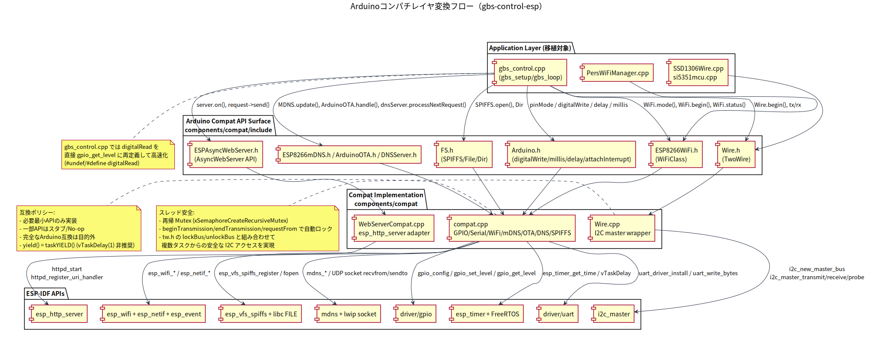

# Arduinoコンパチレイヤ詳細（ESP-IDF移植）

このドキュメントは、`gbs-control-esp` における Arduino 互換レイヤ（`components/compat`）が、
どのように Arduino/ESP8266 由来APIを ESP-IDF API へ変換しているかを整理したものです。

## 1. 目的と前提

- 目的: 元の `gbs-control` コードを大きく書き換えずに ESP-IDF 上で動かす
- 方針: **必要最小限のAPIのみ** 互換実装（完全な Arduino エミュレーションはしない）
- 実装範囲: GPIO / 時間 / 割り込み / Serial / I2C / Wi-Fi / mDNS / DNS / Webサーバ / SPIFFS など

関連実装:
- `components/compat/include/Arduino.h`
- `components/compat/compat.cpp`
- `components/compat/Wire.cpp`
- `components/compat/WebServerCompat.cpp`

図:
- `docs/uml/arduino_compat_layer.puml`
- `docs/uml/arduino_compat_layer.svg`

## 2. 層構造（要約）

1. アプリ層（`components/gbs_control/src/*.cpp`）が Arduino風APIを呼び出す
2. 互換ヘッダ（`components/compat/include/*.h`）がインターフェースを提供
3. 互換実装（`components/compat/*.cpp`）が ESP-IDF API に橋渡し
4. ESP-IDF ドライバ/サービスが実行

## 3. 起動と実行時フロー

- `main/main.cpp` の `app_main()` が起点
- `app_main()` -> `xTaskCreate(gbs_task)`
- `gbs_task` 内で `gbs_setup()` を1回実行し、`gbs_loop()` を継続呼び出し
- `gbs_loop()` 内で `handleWiFi()` などを通じて Wi-Fi / Web / DNS / OTA / mDNS の処理を実行

実装参照:
- `main/main.cpp`
- `components/gbs_control/src/gbs_control.cpp`

## 4. API変換マッピング（主要）

### 4.1 時間/スケジューリング

- `millis()` -> `esp_timer_get_time() / 1000`
- `micros()` -> `esp_timer_get_time()`
- `delay(ms)` -> `vTaskDelay(pdMS_TO_TICKS(ms))`（`ms==0` は `taskYIELD()`）
- `delayMicroseconds(us)` -> `esp_rom_delay_us(us)`
- `yield()` -> `vTaskDelay(1)`

実装: `components/compat/include/Arduino.h`

### 4.2 GPIO / 割り込み

- `pinMode()` -> `gpio_config()`
- `digitalWrite()` -> `gpio_set_level()`
- `digitalRead()` -> `gpio_get_level()`
- `attachInterrupt()` -> `gpio_install_isr_service()` + `gpio_isr_handler_add()`
- `detachInterrupt()` -> `gpio_isr_handler_remove()`

実装: `components/compat/compat.cpp`

注意点:
- `components/gbs_control/src/gbs_control.cpp` 側で `digitalRead` を直接 `gpio_get_level` に再定義している箇所がある（高速化意図）

### 4.3 Serial

- `HardwareSerial::begin()` -> `uart_driver_install()` + `uart_param_config()`
- `write/read/available` -> `uart_write_bytes()` / `uart_read_bytes()` / `uart_get_buffered_data_len()`

実装:
- `components/compat/include/HardwareSerial.h`
- `components/compat/compat.cpp`

### 4.4 I2C（Wire）

- `Wire.begin()` -> `i2c_new_master_bus()`
- `Wire.beginTransmission()/endTransmission()` -> `i2c_master_transmit()` / `i2c_master_probe()`
- `Wire.requestFrom()` -> `i2c_master_receive()`
- `Wire.setClock()` -> デバイスキャッシュ再生成（新周波数適用）

実装:
- `components/compat/include/Wire.h`
- `components/compat/Wire.cpp`

補足:
- アドレスごとに `i2c_master_dev_handle_t` をキャッシュ（最大4）

### 4.5 Wi-Fi（ESP8266WiFi互換）

- `WiFi.begin()` -> `esp_wifi_set_mode(WIFI_MODE_STA)` + `esp_wifi_set_config()` + `esp_wifi_start()` + `esp_wifi_connect()`
- `WiFi.status()` -> `esp_wifi_sta_get_ap_info()` ベース判定
- `WiFi.softAP()` -> `esp_wifi_set_mode(WIFI_MODE_AP)` + `esp_wifi_set_config()` + `esp_wifi_start()`
- `WiFi.softAPConfig()` -> `esp_netif_set_ip_info()` + DHCP server再起動
- `WiFi.hostname()` -> `esp_netif_set_hostname()`
- `WiFi.scanNetworks()` -> `esp_wifi_scan_start()` + `esp_wifi_scan_get_ap_records()`

実装:
- `components/compat/include/ESP8266WiFi.h`
- `components/compat/compat.cpp`

### 4.6 Webサーバ（ESPAsyncWebServer互換）

- `AsyncWebServer::on()` でルートを保持
- `begin()` 時に `httpd_start()` + `httpd_register_uri_handler()`
- `AsyncWebServerRequest` が query / form body をパース
- `request->send(...)` 系は `httpd_resp_*` に変換

実装:
- `components/compat/include/ESPAsyncWebServer.h`
- `components/compat/WebServerCompat.cpp`

制約:
- 元ライブラリの非同期機能を完全再現するものではなく、必要な範囲を対象とした互換

### 4.7 ファイルシステム（SPIFFS / File / Dir）

- `SPIFFS.begin()` -> `esp_vfs_spiffs_register()`
- `SPIFFS.format()` -> `esp_spiffs_format()`
- `SPIFFS.open()` -> `fopen()`（`/spiffs` 配下へパス変換）
- `File` 操作は libc FILE API を薄くラップ
- `Dir` は `opendir/readdir/stat`

実装:
- `components/compat/include/FS.h`
- `components/compat/compat.cpp`

### 4.8 mDNS / OTA / DNS

- mDNS:
  - `MDNS.begin()` -> `mdns_init()` + `mdns_hostname_set()`
  - `MDNS.addService()` -> `mdns_service_add()`
  - `MDNS.update()` は No-op（ESP-IDF側がバックグラウンド処理）
- OTA:
  - `ArduinoOTA.begin()/handle()` は現状スタブ（ログのみ、実OTA処理なし）
- DNS:
  - `DNSServer` は UDP socket で簡易DNS応答（キャプティブポータル用途）

実装: `components/compat/compat.cpp`

## 5. スタブ/差分（重要）

- `analogRead()` は現状 `0` を返す実装（未対応）
- `ArduinoOTA` は互換インターフェースのみ（実体はスタブ）
- `ESPAsyncTCP.h` は依存解決用スタブ
- `WiFi.onStationModeDisconnected(...)` は互換シグネチャのみで実処理なし

実装参照:
- `components/compat/compat.cpp`
- `components/compat/include/ESPAsyncTCP.h`
- `components/compat/include/ESP8266WiFi.h`

## 6. 実装上の注意点

- 互換層は「必要APIだけ」を対象にしているため、Arduinoライブラリ追加時は不足APIが出る可能性がある
- `Wire` は ESP-IDF I2C master の仕様に合わせたため、Arduino環境とタイミング挙動が完全一致しない場合がある
- `WebServerCompat` は esp_http_server ベースのため、ESPAsyncWebServer の厳密挙動（イベント順・一部機能）は差異があり得る

## 7. 拡張ポイント（将来）

- `ArduinoOTA` を `esp_https_ota` ベースで実装
- `analogRead()` の ESP32-C3 ADC 対応
- `WiFi` イベントコールバック（`onStationModeDisconnected` など）の実体化
- `WebServerCompat` の upload/body ハンドリングの互換性向上

